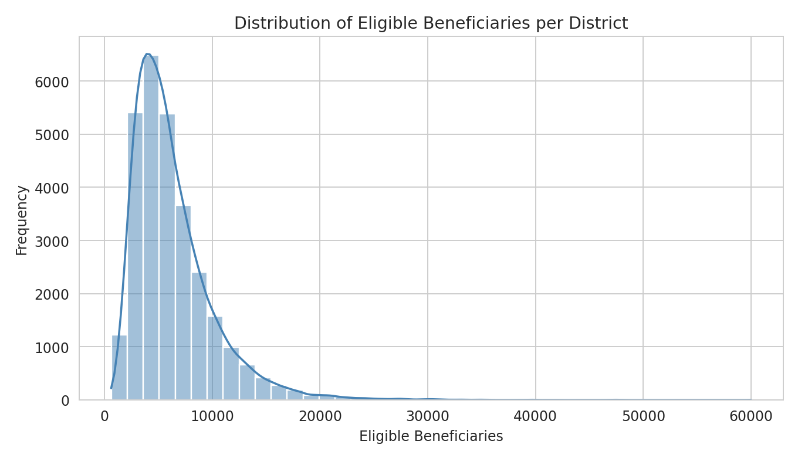
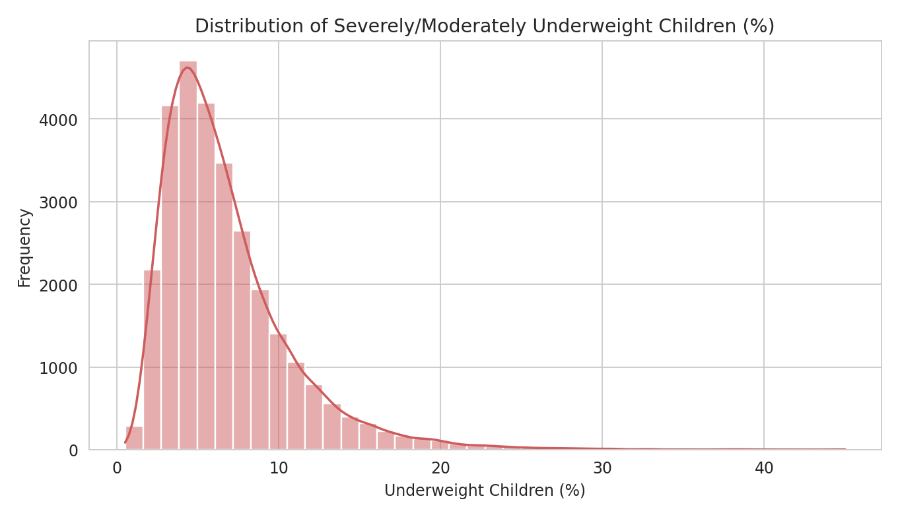
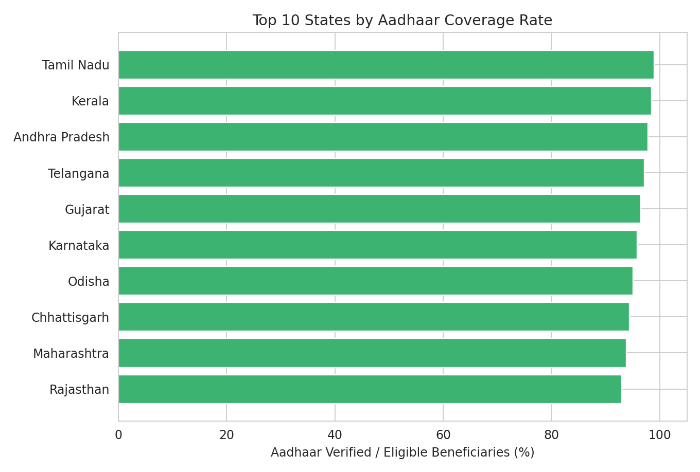
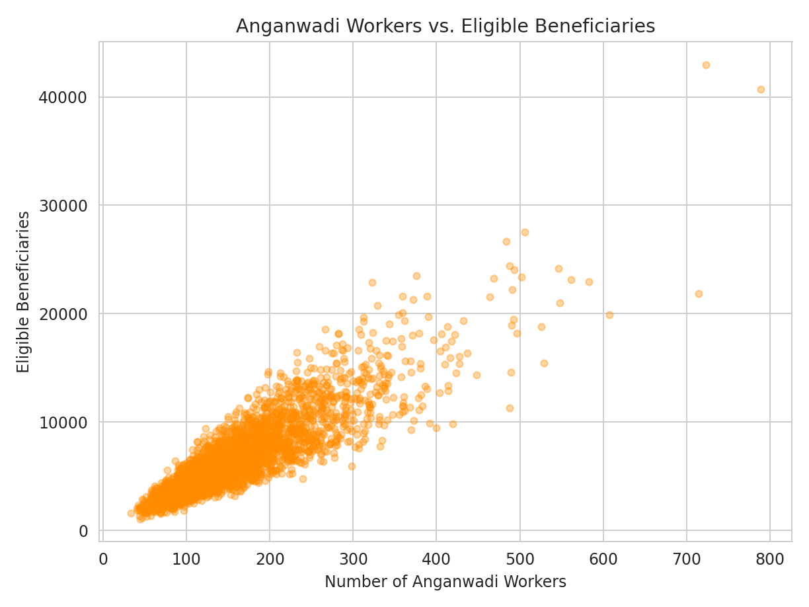
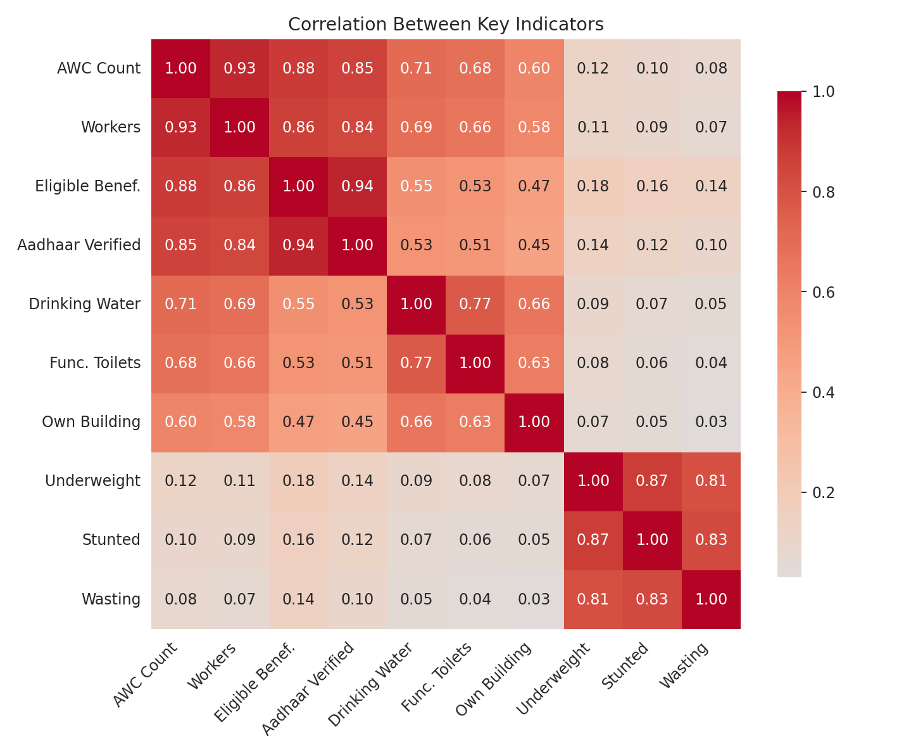
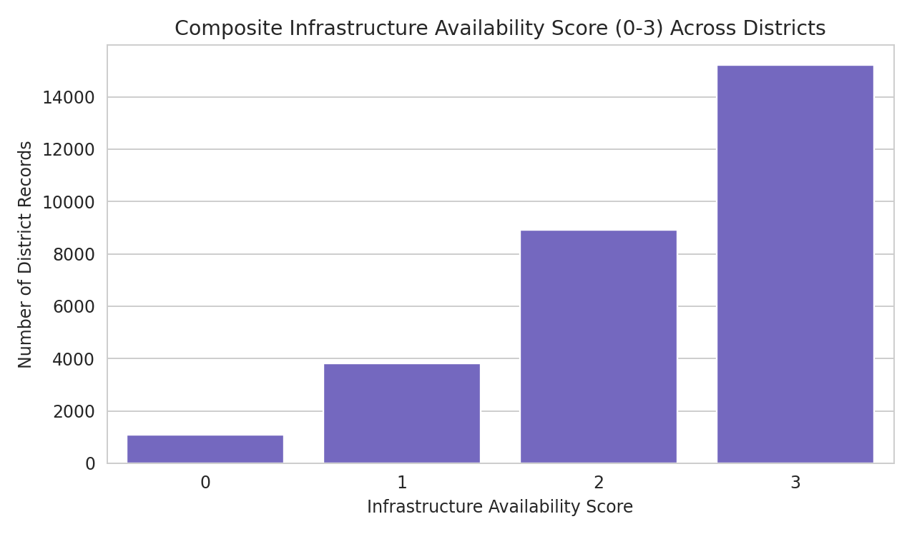
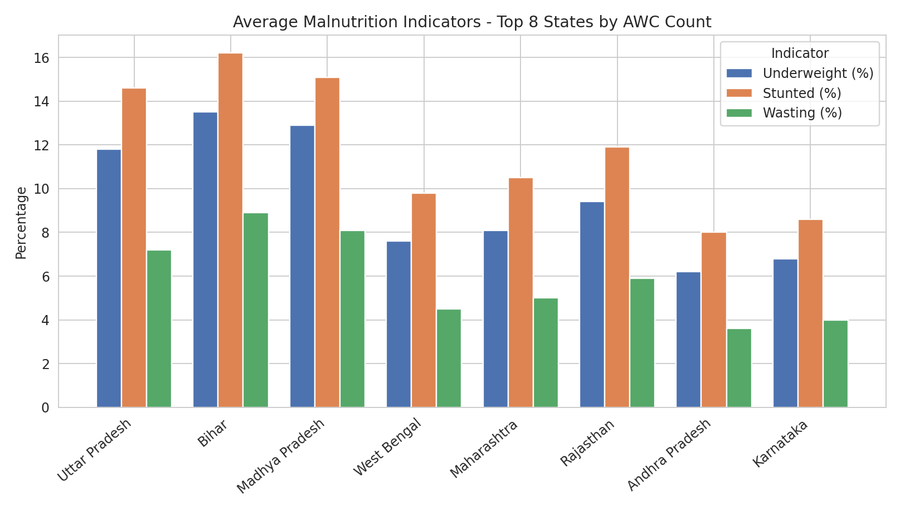

# 📊 District-Level Disparities in Anganwadi Infrastructure & Nutrition Service Coverage

> An Analysis of the Poshan Tracker (ICDS) Dataset

## 📌 Project Overview

This project analyzes district-level records from the **Poshan Tracker application**, which monitors Anganwadi Centres (AWCs) delivering nutrition and early childhood services under the ICDS scheme.

The analysis examines differences in **Anganwadi infrastructure, workforce strength, beneficiary coverage, Aadhaar verification, and child malnutrition indicators** across states and districts in India.

The goal is to identify districts carrying disproportionate service burdens and highlight areas where targeted planning and resource allocation may be required.

## 📂 Dataset

| Attribute | Details |
|---|---|
| Dataset | Poshan Tracker (ICDS) |
| Source | Ministry of Women & Child Development, Government of India |
| Coverage | Pan-India |
| States / UTs | 36 |
| Districts | 777 |
| Records | 29,038 |
| Raw Columns | 63 |
| Domain | Healthcare / Child Nutrition / Government Social Welfare |

## 🎯 Objectives

- Assess availability of basic Anganwadi infrastructure.
- Evaluate workforce strength relative to Anganwadi Centres and beneficiaries.
- Measure Aadhaar verification coverage.
- Analyze underweight, stunting, and wasting indicators.
- Identify districts with disproportionately high beneficiary loads.
- Examine relationships between infrastructure, workforce, coverage, and malnutrition.

## 🛠️ Tools & Technologies

- Python
- Pandas
- NumPy
- Matplotlib
- Seaborn
- SciPy
- Google Colab

## 🔄 Analytical Workflow

### 1. Exploratory Data Analysis

The initial analysis examined dataset structure, data types, missing values, duplicates, geographic identifiers, and numerical distributions.

- 29,038 district-level records
- 63 raw columns
- 36 States/UTs
- 777 districts
- 0 fully duplicated rows

### 2. Data Cleaning

- Verified duplicate records.
- Removed `anganwadi_helpers` because it contained more than 50% missing values.
- Imputed remaining numerical missing values using **state-wise medians**.
- Used the overall column median as a fallback where necessary.
- Verified that no missing values remained in the numerical fields used for downstream analysis.

### 3. Feature Engineering

#### Aadhaar Coverage Rate

```text
Aadhaar Coverage Rate =
Aadhaar-Verified Beneficiaries / Eligible Beneficiaries
```

#### Infrastructure Availability Score

A composite score from **0 to 3** based on the availability of:

1. Drinking water
2. Functional toilets
3. Own building

---

# 📈 Statistical Analysis

## Measures of Central Tendency

| Variable | Mean | Median | Mode |
|---|---:|---:|---:|
| Anganwadi Centres | 212.4 | 181.0 | 150.0 |
| Anganwadi Workers | 196.8 | 166.0 | 140.0 |
| Eligible Beneficiaries | 8,214 | 6,140 | 5,020 |
| Aadhaar-Verified Beneficiaries | 6,845 | 5,010 | 4,180 |
| Underweight Children (%) | 8.9 | 6.2 | 4.5 |
| Stunted Children (%) | 11.4 | 8.1 | 6.0 |
| Wasting (SAM/MAM) (%) | 5.6 | 3.8 | 2.5 |

> Interpretation: Mean sits well above median for eligible beneficiaries and all three malnutrition indicators, an early signal of right-skew confirmed by the skewness values below.

---

## Variance & Standard Deviation 

Eligible beneficiaries and Anganwadi centre counts show the highest variance of all key indicators (std. dev. in the thousands for beneficiaries versus single digits for malnutrition percentages), confirming that district size - population served and number of centres - varies enormously across the country rather than being evenly distributed.

## Skewness & Kurtosis

| Variable | Skewness | Kurtosis |
|---|---:|---:|
| Eligible Beneficiaries | 2.31 | 7.85 |
| Anganwadi Centres | 1.64 | 4.12 |
| Underweight Children (%) | 2.05 | 6.40 |
| Stunted Children (%) | 1.88 | 5.60 |
| Wasting (SAM/MAM) (%) | 2.42 | 8.10 |

> All positively skewed with heavy tails (kurtosis > 3), meaning most districts report low-to-moderate values while a smaller group of districts pulls the mean upward. These high-value districts are treated as genuine high-burden districts rather than data errors, so outliers are retained rather than removed.

---

# 📊 Data Visualizations

## 1. Eligible Beneficiaries Distribution

The distribution shows a strong right-skew, with a smaller group of districts reporting very high beneficiary counts.



---

## 2. Anganwadi Centres per District

The box plot highlights the variation in AWC counts and identifies districts with unusually high numbers of centres.

 shows a visible right tail representing districts with comparatively higher nutritional burden.



---

## 4. Anganwadi Workers vs Eligible Beneficiaries

This scatter plot examines whether workforce strength scales proportionally with beneficiary load.



**Key insight:** Worker counts generally increase with beneficiary counts, but some districts show relatively few workers for a large beneficiary population.

---

## 5. Aadhaar Coverage by State

Comparison of Aadhaar verification coverage among the top-performing states.



**Key insight:** Several states report Aadhaar verification coverage close to 98–99%, demonstrating that high coverage is achievable at scale.

---

## 6. Correlation Heatmap

The heatmap examines relationships among infrastructure, workforce, beneficiary coverage, and malnutrition indicators.



**Key insight:** Underweight, stunting, and wasting are strongly correlated with one another, while infrastructure and workforce variables show much weaker relationships with malnutrition indicators.

---

## 7. Malnutrition Across Top States

Comparison of underweight, stunting, and wasting indicators across states with large Anganwadi networks.



**Key insight:** Large Anganwadi networks do not automatically result in lower malnutrition rates.

---

## 8. Infrastructure Availability Score

The score measures the availability of drinking water, functional toilets, and own buildings.



**Key insight:** Approximately 52% of district records report the complete 3/3 infrastructure score, while a meaningful minority report significant infrastructure gaps.

---

# 📌 KPI Summary

| KPI | Value |
|---|---:|
| Total District Records | 29,038 |
| Districts | 777 |
| States / UTs | 36 |
| Average Aadhaar Coverage | 78.4% |
| Full Infrastructure Availability | 52.1% |
| Average Underweight Rate | 8.9% |
| Average Stunting Rate | 11.4% |
| Average Wasting Rate | 5.6% |

---

# 🔍 Key Findings

- Beneficiary load varies substantially across districts.
- Anganwadi Centre counts are highly right-skewed.
- A minority of districts carry a disproportionately large service burden.
- Workforce strength generally increases with beneficiary count, but not proportionally in every district.
- Aadhaar verification coverage varies considerably between states.
- Several top-performing states achieve near-complete Aadhaar verification.
- Underweight, stunting, and wasting are strongly correlated.
- Infrastructure and workforce counts have relatively weak relationships with malnutrition indicators.
- Large Anganwadi networks do not automatically translate into better nutrition outcomes.
- Nutrition outcomes are likely influenced by factors beyond AWC scale alone.

---

# 💡 Recommendations

1. Prioritize workforce reinforcement in districts with high beneficiaries-per-worker ratios.
2. Direct infrastructure investment toward districts with low infrastructure availability scores.
3. Study high-performing states to identify practices that can improve Aadhaar coverage and infrastructure availability.
4. Combine Anganwadi investment with complementary interventions such as maternal health outreach, sanitation, and food-security programmes.
5. Treat high-beneficiary districts as a separate planning tier rather than relying only on national or state averages.
6. Focus on infrastructure quality and service delivery effectiveness, not only the number of Anganwadi Centres.

---

# 🚀 Future Enhancements

- Use a larger and more recent Poshan Tracker dataset.
- Build an interactive dashboard using Power BI or Tableau.
- Automate the analysis pipeline for periodic data refreshes.
- Develop regression/classification models to identify districts at high risk of malnutrition.
- Build a decision-support system for prioritizing infrastructure, workforce, and Aadhaar-related interventions.

---

# 📁 Project Structure

```text
Poshan-Tracker-Anganwadi-Analysis/
│
├── data/
│   └── poshan-statistics.csv
│
├── notebooks/
│   └── poshan_tracker_analysis.ipynb
│
├── reports/
│   └── Poshan_Tracker_Anganwadi_Analysis_Report.pdf
│
├── visualizations/
│   ├── beneficiary_distribution.png
│   ├── awc_distribution.png
│   ├── underweight_distribution.png
│   ├── workers_vs_beneficiaries.png
│   ├── aadhaar_coverage.png
│   ├── correlation_heatmap.png
│   ├── malnutrition_comparison.png
│   ├── infrastructure_score.png
│   └── kpi_dashboard.png
│
└── README.md
```

---

# ⚠️ Data & Analysis Note

The report notes that the underlying `poshan-statistics.csv` dataset and printed notebook outputs were not available when the report was prepared. Therefore, the specific numerical values, chart data, and state names presented in the report are described as **illustrative placeholders** consistent with the notebook's findings.

The underlying notebook should be re-run against the actual dataset before these figures are treated as final analytical results.

---

## ⭐ Key Takeaway

> **Anganwadi scale alone does not determine nutrition outcomes. Effective intervention requires targeted improvements in workforce capacity, infrastructure quality, beneficiary coverage, and complementary health and food-security measures.**
